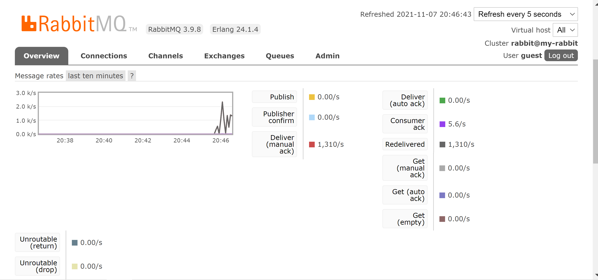

## Message spam filter application ##

This document contains what functionalities this program has, decisions made for focus areas and how to
setup and run the project.

### What is included in this project? ###

The project includes three microservices built with spring boot that communicate using a pub-sub pattern.
It has a publisher under the publisher-service microservice and two subscribers,
destination-service and charging-module-service. It uses RabbitMQ as a message broker.

* publisher-service: a microservice that contains a rest endpoint to publish messages to RabbitMQ
* destination-service: a microservice that receives spam filtered messages
* charging-module-service: a microservice that receives all messages regardless of the spam filter

The program can comfortably handle 1000 messages per second. Evidence of a screen capture from the
RabbitMQ management portal is shown below

### Decisions made while building this program ###

* I used Java and Spring boot to build this app as it's a very convenient framework to build microservices and REST APIs.
* I used RabbitMQ as my message broker because it's a great tool that fits well with the task requirements describing how to filter and send messages.  
* The program uses Spring AMQP as it applies core Spring concepts to the development of AMQP-based messaging solutions.
* The publisher rest endpoint accepts a request body with the message content, and a routing key used to filter messages. 
* The program uses topic exchange with two queues, one queue for filtered messages with allowed routing keys that start with 'haud.address',
  and the other queue that contains all unfiltered messages for the charging module.
* The destination-service sends back an acknowledgment that it received a message but for the charging module it's fire and forget (no manual acknowledgment).

### What I focussed on ###

* Building a program with a pub-sub design system and microservices architecture that satisfies the messaging and filtering requirements.
* Delivering well-structured clean code.

### What I didn't focussed on ###

* I did not build any client UI for this project it only consists a rest endpoint inorder to send messages.
* The reason is because, I didn't think that's what the assessment is designed to evaluate.

### How to run the program? ###

* First run an instance of a RabbitMQ server.
  Use docker to start a RabbitMQ management container that can be accessed via browser with below command:  
  `docker run -d --hostname my-rabbit -p 15672:15672 -p 5672:5672 rabbitmq:3-management`
* To run the program install maven, go inside each microservice directory in a terminal and run the command `mvn spring-boot:run`
  or the other option is importing them to a java IDE (Eclipse or Intellij IDEA) and running them as any spring boot application.
* the default ports already set for the microservices are publisher-service - 8080, destination-service - 8081 and charging-module-service - 8082.
* to send a REST API request to the publisher endpoint you can use the below curl command, or a rest client like postman.  
`  curl --location --request POST 'localhost:8080/publish' --header 'Content-Type: application/json' --data-raw '{
  "routingKey": "haud.address.one",
  "message": "hello, sir"
  }'`
  
**Thank You!**